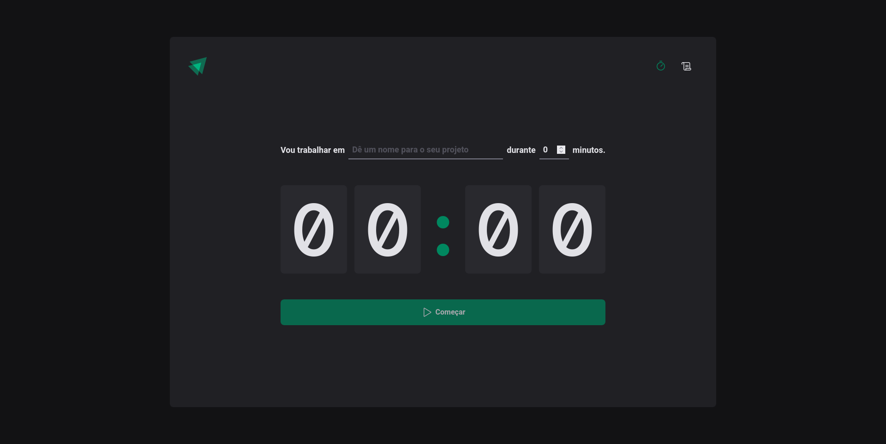

# ⏳⏰ Ignite Timer

&nbsp;

  
  
  
  

&nbsp;

## 🖼 Imagens do projeto:

&nbsp;

## 🛠️ Tecnologias/Ferramentas ultilizadas

* [Vite](https://vitejs.dev/)
* [Typescript](https://www.typescriptlang.org/)
* [React Hook Form](https://react-hook-form.com/)
* [Zod](https://zod.dev/)
* [Styled Components](https://styled-components.com/)
* [React Router Dom](https://v5.reactrouter.com/web/guides/quick-start)

&nbsp;

### 🔗 Projeto Online
* [Ignite Timer](https://ignite-timer-one-alpha.vercel.app//)

&nbsp;

## 💚 Feito por Jean Fernandes de Macedo

